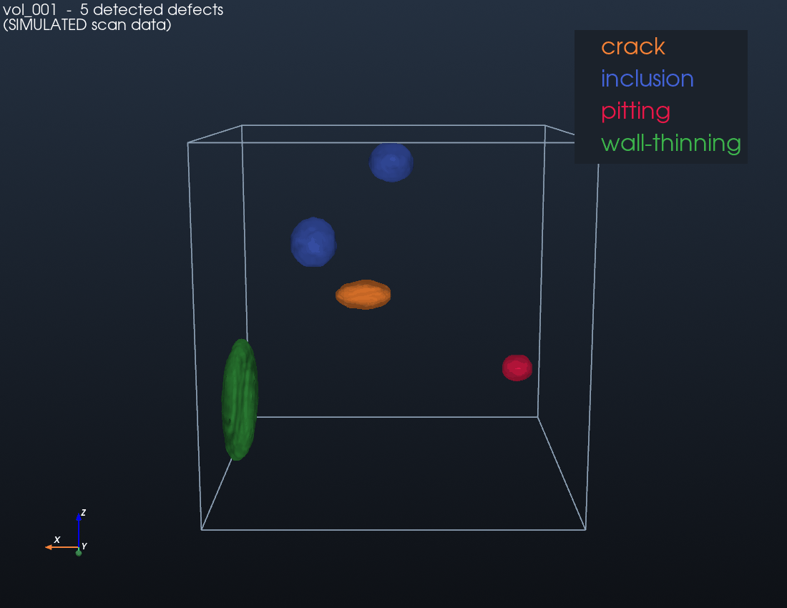
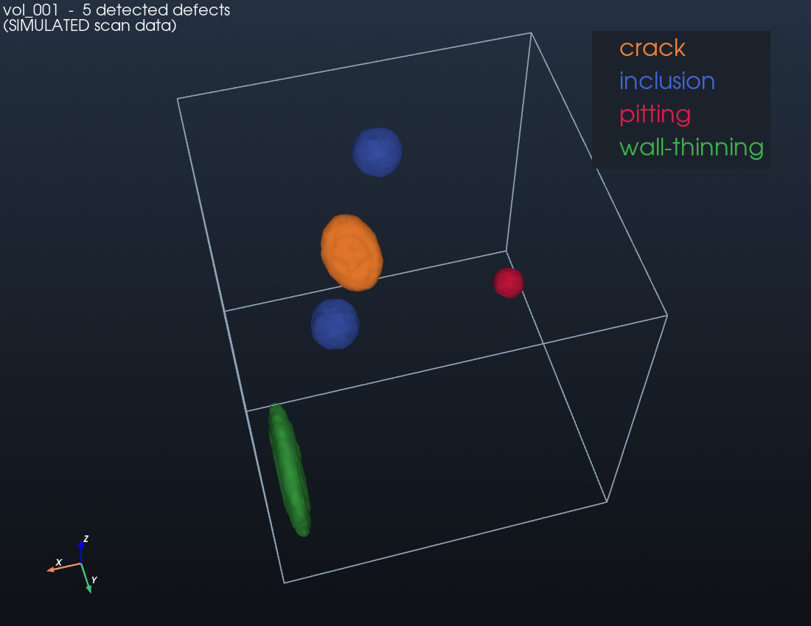
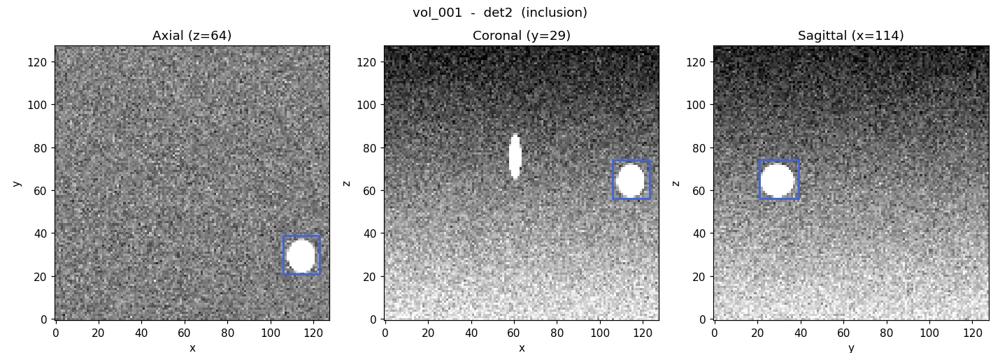

# VoxelScan — 3D Defect Detection & Inspection Reporting

A pipeline that ingests **simulated** 3D volumetric scan data (in the style of
ultrasonic / acoustic inspection), detects and measures defects inside the
volume, produces interactive 3D visualizations with defects highlighted, adds a
human-in-the-loop review step, and generates client-style PDF inspection
reports.

It mirrors the analysis loop of pipeline in-line inspection — find
millimetre-scale defects in dense volumetric scan data, measure them, classify
them, visualise them, and report them — on synthetic-but-controlled data whose
ground truth is fully known, so **every accuracy number is measurable**.

> ⚠️ **Data is 100% synthetic.** These are simulated volumetric amplitude
> volumes with planted defects. The project models the *analysis workflow*, not
> the underlying acoustic physics — it is not calibrated ultrasound, and it does
> not use or represent any real asset, pipeline, or client data.



---

## What it does

1. **Generate** synthetic 128³ "pipe-wall" volumes with realistic baseline,
   depth attenuation, and speckle noise, planting defects of four types
   (pitting, crack, inclusion, wall-thinning) with a known ground-truth
   manifest.
2. **Detect & measure** defects: local-baseline anomaly detection + 3D
   connected components, measuring centroid, bounding box, volume, equivalent
   diameter, and peak intensity deviation for each region.
3. **Evaluate** against ground truth: recall, precision, false positives,
   localization error, sizing error — across an easy→hard difficulty gradient.
4. **Classify** defect type with a small RandomForest (honest 5-fold CV score),
   over a rule-based baseline.
5. **Visualise** in 3D (PyVista) with colour-coded defect isosurfaces, plus 2D
   axial/coronal/sagittal slice views.
6. **Review** each detection (human-in-the-loop): confirm / reject / reclassify.
7. **Report**: a client-style PDF per scan with metadata, an auto-written
   factual findings summary, a confirmed-defect table, the 3D render, and slice
   views of the most severe defects.

---

## Measured results

<!-- METRICS:START (auto-generated by run_all.py - do not edit by hand) -->
_Measured over 20 generated volumes (117 planted defects), IoU match threshold 0.1._

| Metric | Value |
|---|---|
| Detection recall | **0.863** (101/117) |
| Detection precision | **0.971** (101/104) |
| F1 | 0.914 |
| False positives (total) | 3 |
| Mean IoU (matched) | 0.532 |
| Centroid localization error | 0.31 voxels |
| Diameter sizing error (median) | 22.2% (bias +20.5%) |
| Type classifier accuracy (5-fold CV) | **97.0%** (heuristic baseline 69.3%) |
| Detection throughput | 120 regions in 7.0s over 20 volumes |

Per-type detection recall:

| Defect type | Recall | Planted |
|---|---|---|
| pitting | 0.86 | 42 |
| crack | 0.88 | 25 |
| inclusion | 1.00 | 22 |
| wall-thinning | 0.75 | 28 |


<!-- METRICS:END -->

All numbers above are written directly from the run outputs
(`data/metrics_summary.json`, `data/classifier_metrics.json`) by `run_all.py` —
none are hand-entered. A fuller breakdown (per-volume table, per-type recall,
classifier per-class recall, severity distribution, methodology) is in
**[RESULTS.md](RESULTS.md)**.

---

## How it works

| Phase | Script | Output |
|---|---|---|
| 1. Synthetic data | `generate_volume.py` | volumes + ground-truth manifests + previews |
| 2. Detection & measurement | `detect.py` | detections + recall/precision metrics |
| 2b. Type classifier | `classify.py` | RandomForest model + CV accuracy |
| 3. Visualization + review | `visualize.py` | 3D renders, slice views, review decisions |
| 4. Reporting | `report.py` | per-scan PDF inspection report |
| 5. Orchestration | `run_all.py` | runs everything + refreshes this README |

**Key design choices that make the numbers meaningful**

- **Depth attenuation** makes the baseline vary through the wall, so a single
  global threshold fails — detection estimates a *local baseline per depth
  slice* (robust median), then flags residuals in either direction (bright
  inclusions/cracks *and* dark pitting/wall-thinning).
- **Difficulty gradient** (noise ↑, contrast ↓, size ↓) means recall degrades
  gracefully instead of sitting at a meaningless 100%.
- **Ground-truth label volumes** enable exact IoU matching between detections
  and planted defects.

---

## Setup

```bash
python -m venv .venv && source .venv/bin/activate   # optional
pip install -r requirements.txt
```

Python 3.11+ recommended. Dependencies: NumPy, SciPy, scikit-image, Matplotlib,
scikit-learn, PyVista (3D), fpdf2 (PDF).

**Headless / off-screen rendering.** PyVista rendering runs off-screen
(`pyvista.OFF_SCREEN = True`) so it works without a display. On macOS this works
out of the box. On a headless Linux server, install a virtual framebuffer and
start it before rendering:

```bash
# Debian/Ubuntu
sudo apt-get install -y libgl1-mesa-glx xvfb
```
```python
import pyvista as pv
pv.start_xvfb()      # once, before rendering
```
or simply run under `xvfb-run -a python run_all.py`.

---

## Usage

Run the whole pipeline end to end (generates data, detects, classifies,
renders, reviews, reports, and refreshes the metrics above):

```bash
python run_all.py                 # 20 volumes, one demo orbit GIF
python run_all.py -n 8 --no-gif   # smaller/faster run
```

Or run phases individually:

```bash
python generate_volume.py                 # Phase 1
python detect.py                          # Phase 2  (prints recall/precision)
python classify.py                        # Phase 2b (prints CV accuracy)
python visualize.py --vol vol_000 --gif   # Phase 3  (interactive review at a TTY)
python visualize.py --all --auto-review   # non-interactive review for all
python report.py --vol vol_000            # Phase 4
```

**Human-in-the-loop review.** `visualize.py` presents each detection with its
measurements. At a real terminal it prompts to `[c]onfirm / [r]eject /
[t]ype reclassify`; with `--auto-review` it applies a documented confidence
policy so the pipeline is reproducible unattended. Decisions are stored in
`data/reviews/` and drive the report's confirmed-defect list.

---

## Repository structure

```
generate_volume.py   Phase 1 — synthetic volume + ground-truth generator
detect.py            Phase 2 — detection, measurement, evaluation
classify.py          Phase 2b — scikit-learn defect-type classifier
visualize.py         Phase 3 — 3D render, slice views, HITL review
report.py            Phase 4 — PDF inspection report
run_all.py           Phase 5 — end-to-end runner + README metrics refresh
common.py            shared conventions, schema, I/O, severity index
requirements.txt
docs/                curated showcase assets (render, GIF, curve, sample report)
data/                generated working data (gitignored — regenerate anytime)
```

---

## Sample outputs

| 3D defect map | Orthogonal slices |
|---|---|
|  |  |

A sample generated PDF report is at [`docs/sample_report.pdf`](docs/sample_report.pdf).

---

## Honesty & limitations

- **Synthetic data only.** Nothing here is a real scan, asset, or client
  deliverable. Defects are planted procedurally.
- **Not acoustic physics.** Volumes model amplitude/anomaly *analysis*, not wave
  propagation, attenuation physics, or transducer behaviour.
- **Severity is an index, not a code grade.** It combines size × intensity
  deviation to rank findings; it is not an engineering fitness-for-service
  assessment.
- **All metrics are measured** from the actual run over the generated set and
  refreshed into this README by `run_all.py`.
