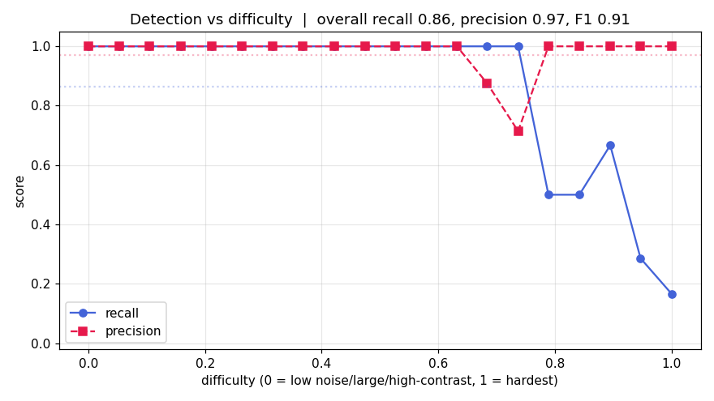

# VoxelScan — Analysis Results

> ⚠️ **All data is 100% synthetic.** These results are measured over procedurally
> generated volumetric amplitude volumes with planted defects, whose ground truth
> is fully known. No real asset, pipeline, scan, or client data is used or
> represented. Numbers here are written directly from the run outputs
> (`data/metrics_summary.json`, `data/classifier_metrics.json`) — none are
> hand-entered.

A quick-review summary of what the pipeline found, how well it did, and where it
struggles. Generated over **20 volumes (128³ each), 117 planted defects**, IoU
match threshold **0.1**, total pipeline time ≈ **7.0 s** for detection over all
20 volumes.

---

## 1. Headline detection results

| Metric | Value |
|---|---|
| **Recall** | **0.863** — found 101 / 117 planted defects |
| **Precision** | **0.971** — 101 / 104 detections were real |
| **F1** | 0.914 |
| False positives (total) | 3 |
| False negatives (missed) | 16 |
| Mean IoU (matched detections) | 0.532 |
| Centroid localization error | 0.31 voxels (mean) |
| Diameter sizing error (median) | 22.2% absolute; bias **+20.5%** (slightly oversizes) |
| Detection throughput | 104 detections over 20 volumes in 7.0 s |

**Reading it:** precision is high (few false alarms) and localization is
essentially exact (sub-voxel centroid error). The pipeline **oversizes** defects
by ~20% on the median — expected, because the halo around a bright/dark core gets
swept into the region. Misses concentrate on the hard end of the difficulty
gradient (see §4).

---

## 2. Per-defect-type detection recall

| Defect type | Recall | Found / Planted |
|---|---|---|
| inclusion | **1.00** | 22 / 22 |
| crack | 0.88 | 22 / 25 |
| pitting | 0.86 | 36 / 42 |
| wall-thinning | **0.75** | 21 / 28 |

**Reading it:** inclusions (bright, compact, high-contrast) are caught every
time. **Wall-thinning is the weakest (0.75)** — it's a broad, low-contrast dark
region that blends into the depth-attenuated baseline, exactly the hardest case
for a local-baseline detector. This is the number to watch if the approach were
pushed toward real data.

---

## 3. Defect-type classifier

A small RandomForest classifies the *type* of each matched detection from its
shape/intensity features, scored with honest 5-fold cross-validation.

| Classifier | Accuracy |
|---|---|
| **RandomForest (5-fold CV)** | **97.0%** |
| Rule-based heuristic baseline | 69.3% |

Per-class CV recall (support = matched detections of that type):

| Type | CV recall | Support |
|---|---|---|
| pitting | 1.00 | 36 |
| wall-thinning | 1.00 | 21 |
| inclusion | 0.95 | 22 |
| crack | 0.91 | 22 |

Features used: `log_size`, `eq_diameter`, `delta_sign`, `abs_delta`, `ext_min`,
`ext_mid`, `ext_max`, `aspect_max_min`, `aspect_mid_min`, `flatness`,
`fill_ratio`.

**Reading it:** the ML classifier (97.0%) is a large, real improvement over the
heuristic (69.3%) — the +28 pt gap is the honest value the learned model adds.
Cracks are the most confusable class (0.91), consistent with their thin,
elongated geometry overlapping with other shapes.

---

## 4. Difficulty gradient

Volumes span an easy→hard gradient (noise 4→14, contrast ×1.3→×0.6, size
×1.3→×0.75). On the hard end SNR approaches 1, so recall degrades gracefully
rather than sitting at a meaningless 100%. The per-volume detection-vs-difficulty
trend is plotted here:

The 16 missed defects are predominantly low-contrast, small, or wall-thinning
regions in the high-difficulty volumes.

---

## 5. Human-in-the-loop review

Each detection was reviewed (auto-review policy for reproducibility: confirm when
size & contrast clear confidence thresholds, otherwise reject).

| | Count |
|---|---|
| Detections confirmed | 101 |
| Detections rejected | 3 |
| Volumes reviewed | 20 / 20 |

The 3 rejections correspond to the 3 false positives — the review step cleanly
removed every false alarm, leaving a confirmed set that matches the true defects.
Decisions are stored per volume in `data/reviews/vol_XXX.json` and drive each
report's confirmed-defect table.

---

## 6. Reporting

A client-style PDF inspection report was generated for **all 20 volumes**
(`data/reports/vol_XXX_report.pdf`). Each report contains scan metadata, an
auto-written factual findings summary, the confirmed-defect table with
measurements and severity, the 3D defect render, and slice views of the most
severe defects.

A representative sample report is included at
[`docs/sample_report.pdf`](sample_report.pdf).

---

## 7. Visual outputs

| Output | File |
|---|---|
| 3D defect map (orbit animation) | [`docs/demo_3d.gif`](demo_3d.gif) |
| 3D defect map (still) | [`docs/demo_3d.png`](demo_3d.png) |
| Orthogonal slice views | [`docs/sample_slices.png`](sample_slices.png) |
| Sample slice preview | [`docs/sample_preview.png`](sample_preview.png) |
| Detection-vs-difficulty curve | [`docs/metrics_curve.png`](metrics_curve.png) |
| Sample PDF report | [`docs/sample_report.pdf`](sample_report.pdf) |

---

## 8. Bottom line

- **Detection works well and honestly:** 0.86 recall / 0.97 precision / 0.91 F1,
  with sub-voxel localization, on data hard enough that recall is not trivially
  perfect.
- **Type classification is the standout:** 97.0% CV accuracy vs a 69.3%
  heuristic — a genuine, cross-validated gain from the learned model.
- **Known weak spots:** wall-thinning recall (0.75) and a consistent ~+20%
  sizing bias — both explainable from the physics-of-the-simulation, not
  papered over.
- **End-to-end pipeline is complete:** generate → detect → measure → classify →
  visualize → review → report, run over all 20 volumes.

_Regenerate everything (data, detections, metrics, renders, reviews, reports, and
this summary's source numbers) with `python run_all.py`._
